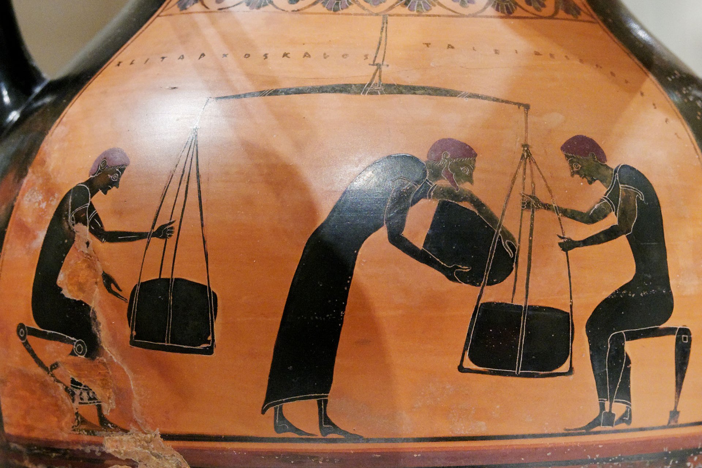
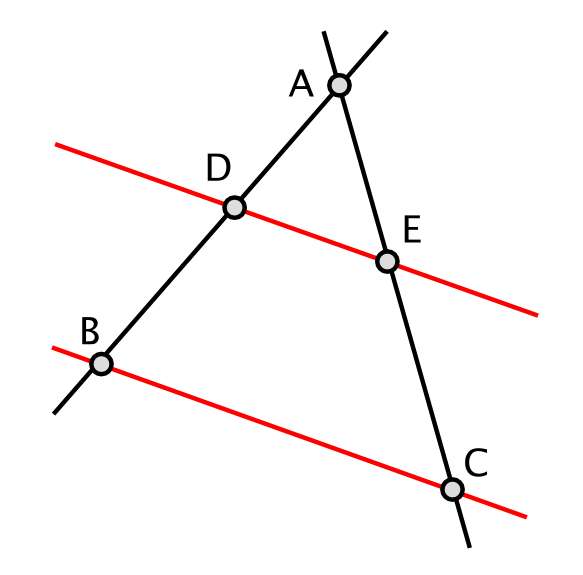
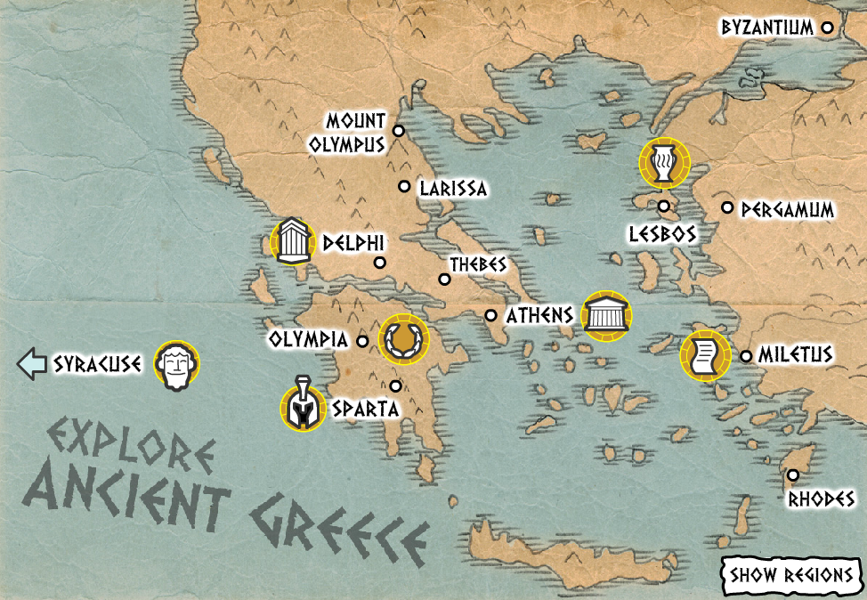
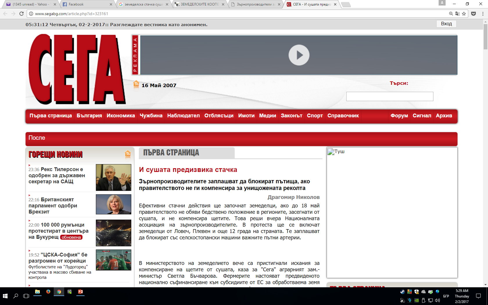
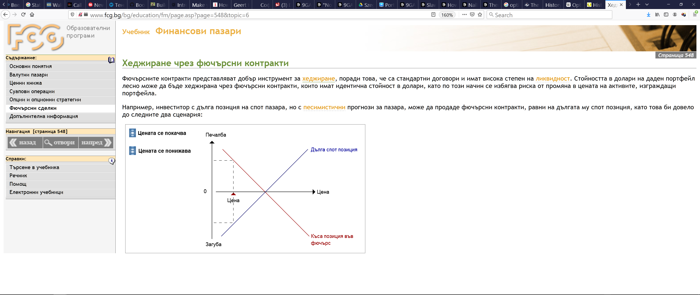
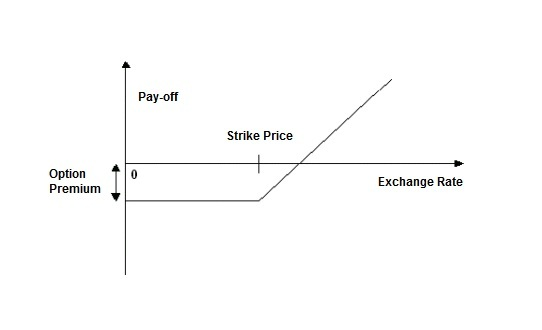
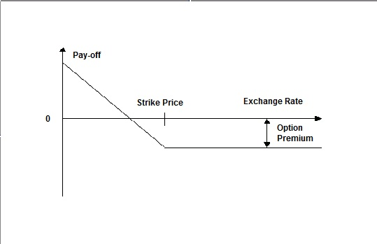

# Derivatives

# 

# "Why aren't you richer when you're so smart?"

# 

Creative commons \- Angel Marchev\, Jr\.

# General definition

purposefully created financial instrument\,

which has no independent intrinsing value \)\,

whose price depends on the movement of the price of an underlying asset \.

\(underlying asset: stock\, investment portfolio\, commodity\, law\, currency or anything else that has a price as a result of being traded on an organized market\)

# Termed deals

agreements between two parties

transfer of ownership of an asset

for standardized \( futures \) / non\- standardized \( forward \) quantity

on a standardized \( futures \) / non\- standardized \( forward \) date in the future

at a price fixed on the day of concluding the transaction

such as its implementation is mandatory in real delivery / in cash payment

# Futures transactions

Hedging \(by producer / owner of the underlying asset\)

Speculation \(by the counterparty to the transaction\)

# Options

The buyer of an option contract\,

1\) buys the right\, but not the obligation to

2\) buy \( call option\) / sell \( put option\)

3\) in \(European type option\) / until \(American type option\) a certain future moment\,

4\) some underlying asset \(stock\, bond\, index\, currency pair\, interest rate…\)

5\) at a fixed price of the underlying asset \( strike price\) / at a fixed method for determining the price of the underlying asset \(Asian type option\)

6\) against payment of an option premium\.

# Call option

Example: a trader buys a call option to buy one lot of XYZ shares at a strike price of 1\.30 within one month\.

If the price of XYZ is below 1\.30\, the option is not exercised\, and the buyer loses only the premium \.

If the price of XYZ rises to 1\.40\, the buyer exercises the option and buys the specified amount at a strike price of 1\.30 and makes a profit by limiting his loss \.

Buying a call option relies on a rising market price\, selling a call option relies on a falling market\.

# Put option

Example: a trader buys a put option to sell one lot of XYZ at a strike price of 1\.30 within one month\.

If the price of XYZ is over 1\.30\, the option is not exercised\, and the trader only loses the premium \.

If the price of XYZ falls to 1\. 0 0\, the trader exercises the option and sells the specified amount at a strike price of 1\.30 and makes a profit by limiting his loss \.

Buying a put option relies on a declining market price\, selling a put option relies on a rising market\.

