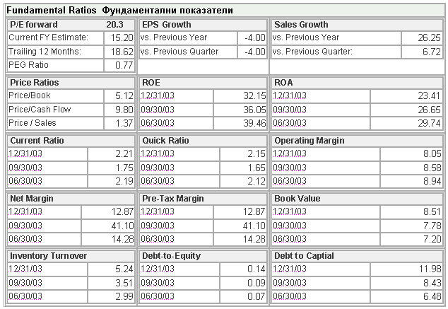

# Methods for investment analysis and selection of investment instruments

# Preliminary clarifications

There is no clear boundary and classification between methods for analysis\, forecasting\, optimization and modeling

The concepts of analysis and forecasting do not contradict each other\. On the contrary\, financial analysis and forecasting are always used together

Much of the toolkit is in many cases the same

# Approaches to financial analysis

There are two traditional approaches: fundamental analysis and technical analysis

The two approaches are based on two totally different hypotheses \- the existence of a causal relationship and the stochastic nature of the "World We Live In"\.

The technical analysis considers that the stock market is 80% psychology and 20% logic\, while the fundamental one considers the exact opposite\.

# Common properties of both approaches

Art rather than science \- both types of analysis are based on the analyst's subjective judgment

The results are open to interpretation \- two analysts find different dependencies\, trends and possible developments\, supported by logically correct reasoning\.

# Fundamental analysis

A logical \, causal link between the dynamics of the price of the financial instrument and the economic situation is sought

The main economic and market factors such as annual profit\, dividends paid\, the relationship between share price and profit\, macroeconomic indicators and others are considered\.

# Technical analysis

Disregards the economic logic

Considers the phenomenon as time series\, trying to find a regular dependence in it

The focus is on historical data on price movements\, traded volume\, trend and many quantitative methods\.

# Information sources

* For fundamental analysis:
  * Current political / economic news
  * Official statistical reports
  * Annual reports
  * Specialized editions
  * University research
  * Analyzes by specialists
* For technical analysis:
  * Historical price data

# Analysis of expectations

Bernie Shiffer

The market as a general entity

Using concepts from fundamental and technical analysis

Possible approaches to

survey of expectations

# Portfolio theory

The concept of a portfolio

Modern theory\. Markovitz model

A method for selecting many instruments as a whole group\, as opposed to technical and fundamental analysis

Efficient portfolio

Evolution of the theory

# Efficient Markets

Efficient market \- etymology

Efficient market hypothesis \- universal\, symmetrical access to essential information leads to meaningless application of forecasting and analysis methods

“Random walk” / “Drunken monkey” hypothesis

# Non-traditional quantitative methods of analysis

* An alternative philosophy for the world
* Derived from other non\-quantitative methods
* Founding:
  * Chaos theory; Fractals
  * Genetic algorithms
  * Image recognition
  * Neural Networks
  * Blurred sets
  * Self\-organization

