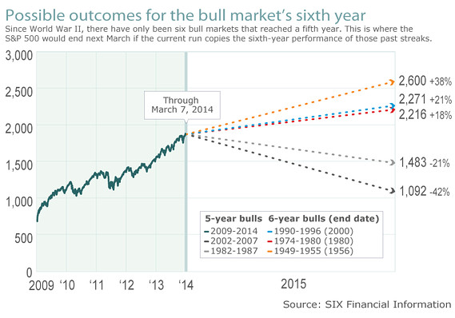
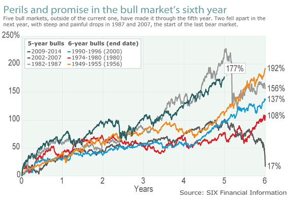
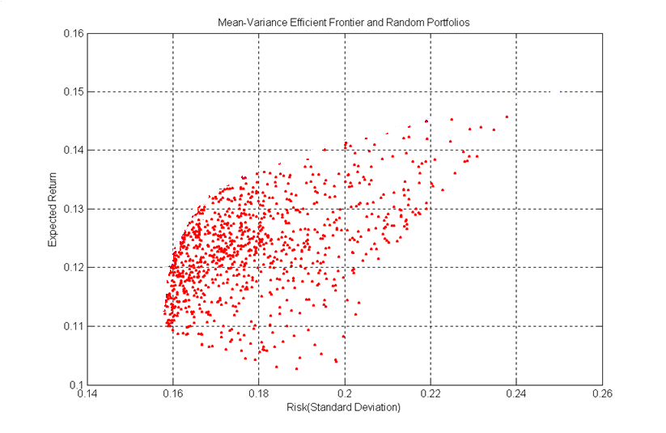
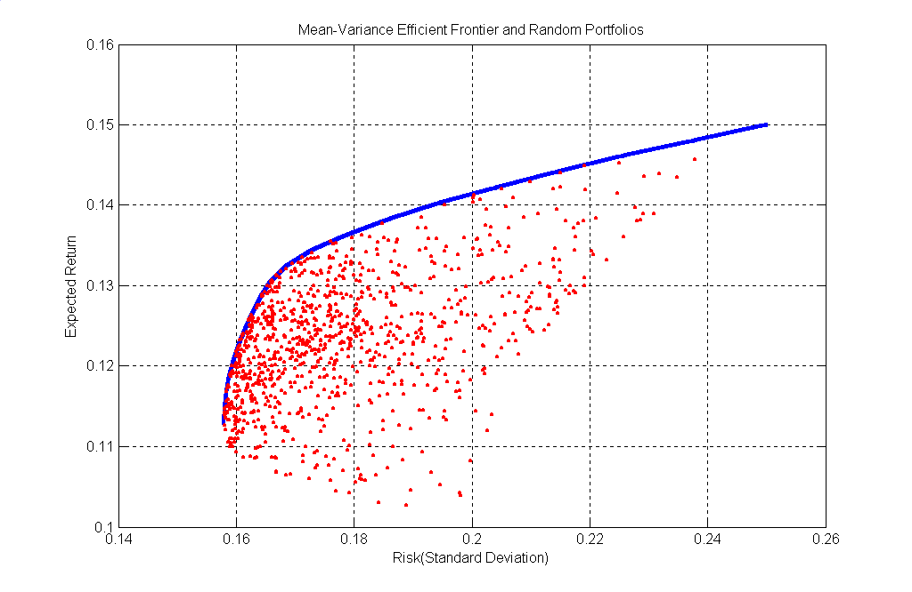
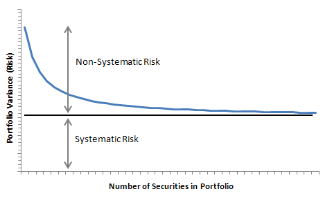
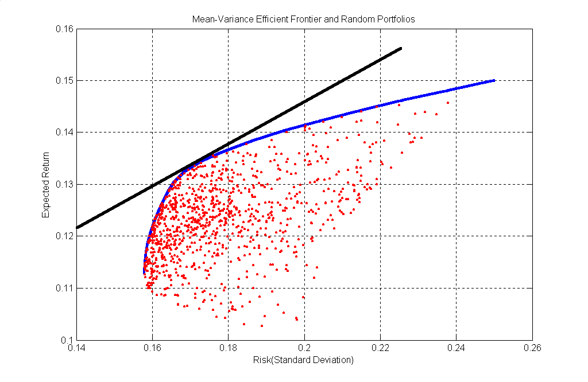

# Modern portfolio theory

# Angel Marchev, Jr.

# 

# DEFINITIONS

Investment  Consumption

Investor – entity \(physical or legal\) using financial \(and other\) resources and pursuing future reward

Securities – investment opportunities \(investment instruments\)\, traded freely on the market

Portfolio – Combination of securities owned by a given investor\.

In general the portfolio includes all the investments of an investor – financial\, material\, non\-material\. In this case emphasis will be on financial securities\. So “portfolio” will mean investment portfolio\, combining financial securities \(or just “securities”\)

All entities possess \(knowingly or not\) \(purposefully or not\) portfolio of some sort\.

# REASONING OF THE PORTFOLIO

The purpose of using a portfolio approach is to improve the conditions of the investment process\.

Obtaining such properties of the combined securities\, which are not obtainable should we use any single security\.

The most often \(but not the only\) considered properties are risk and return

A certain configuration of risk and return is ONLY possible within a given combination\.

# THE MODERN PORTFOLIO THEORY

* Before MPT investors use the concepts of risk and return quiet freely \- they had a vague idea of risk without measuring it
* For years there was intuitive perception that the risk should be diversified \(i\.e\. “Don’t put all the eggs in one basket”\)
* In the 1950s Harry Markowitz created a simple model of a portfolio\, trying to explain the phenomenon of “diversification” \(and others\) scientifically
* His fundamental achievements are:
  * Proposed measure for risk
  * Explained diversification \(portfolio risk\)
  * Optimal set of portfolios
  * Criteria for optimal portfolio selection

# EXPECTED RETURN ON SECURITY (MARKOWITZ)

Investors trade securities for future returns => “ex\-ante” estimations using “ex\-post” data

The easiest way is to use probability expectations for future return on a security

But all sorts of other estimators \(predictors\) can be used

# Fan of possibilities

# Average return

# Moving average return

# Return distributions

# RISK OF A SECURITY (MARKOWITZ)

Variance \(or standard deviation\) of the expected return

Statistical term for measuring dispersion of the probable returns around the expected return

The bigger the variance\, the bigger the risk

# Distribution and risk

# Rolling variance

# Probabilities distribution

# Risk and return

# EXPECTED RETURN OF A PORTFOLIO (MARKOWITZ)

Expected return of a portfolio is equal to the weighted average of the expected returns of the securities included

The weights are the relative shares of each security in the whole portfolio

The sum of all the weights  __is__  1\.0 \(100%\)

# RISK OF A PORTFOLIO (MARKOWITZ)

Again risk is measured by the variance/standard deviation of the expected return of the portfolio

“Although the expected return of a portfolio is wighted average of the expected returns of the securities\,  __THE RISK IS NOT  WEIGHTED AVERAGE OF THE RISK OF THE INDIVIDUAL SECURITIES__  __\.__  __”__  __ __

The mutual interdependence of the securities \(measured by covariance\) should also be considered

Including the covariance permits the investors to reduce the risk of a portfolio

# Correlations

# Correlation and return

# Correlation

# Correlation of the securities

# UNDERSTANDING PORTFOLIO RISK

* The term measuring security interdependence could:
  * Increase portfolio risk \(if positive\)
  * Add noting \(if zero\)
  * Reduce portfolio risk \(if negative\)
* As the number of included securities increases\, the importance of each individual security decreases while the importance of their interdependence increases \(i\.e\. if equal weights…\)
* Three factors determine portfolio risk:
  * Risk \(Variance\) of each security
  * Relative share \(weight\) of each security in the portfolio
  * Interdependence \(covariance\) between every pair of securities

# Number variances and correlations

# Positions weights

# OPTIMAL PORTFOLIO SET

Not feasible region

Not feasible region

Not feasible region

Not feasible region

Not feasible region

Not feasible region

Not feasible region

Optimal portfolio

# INPUT DATA FOR MARKOWITZ MODEL

Expected return\, E\(Ri\) for each security

Variance of returns\, VAR\(Ri\)\, for each security

Covariance COV\(Ri \,Rj\) \(or correlation\)\, between each pair of securities

# SINGLE INDEX MODEL

Markowitz model requires an unpractical number of covariance estimates \(for 500 securities  => 124750 estimates\)

While trying to simplify the computations\, William Sharpe comes up with the concept of the “Diagonal model”\, which also gives new insights into risk

Covariance of the returns tend to be positive\, because the economic forces influencing the securities are the same

All those economic forces could be grouped into one common macro factor\, assuming it generalizes the investment market

Except for this macro factor\, there are also security specific factors

The concept of Market model:

Different securities respond differently to the macro factor

The concept of Factor model:

* What is suitable to be used as a macro factor?
  * It has to be influencing with the investment process
  * It has to generalize the economy
  * It has to be measurable
  * Its data points have to be compatible with the data points for the securities
* Usually a wide market index such as S&P 500 \(thus “ __Single index model__ ”\)

Estimating the SIM:

Method – regression

Estimated variables –   _α_  _i_  _ \, _  _β_  _i_  _ \, VAR\(e_  _i_  _\)_

Number of estimations of covariance – for 500 => 1500

# SYSTEMATIC AND NON-SYSTEMATIC RISK

# INTRODUCING RISK-FREE SECURITY

In theory there is no risk\-free investment

In practice for a short term there are risk\-free securities \(i\.e\. short term Treasury bonds\)

So assuming there is risk\-free security\, it can be combined with an optimal risky portfolio \(security\) in a new “combined” portfolio

Calculation of expected return and risk using Markowitz model

# EXPECTED RETURN OF A COMBINED PORTFOLIO

# RISK OF A COMBINED PORTFOLIO

# INTRODUCING RISK-FREE SECURITY

# EFFECTS OF INTRODUCING RISK-FREE SECURITY

* __The risk\-free security improves the investment conditions__
* __The market portfolio concept__
  * If the optimal set includes all investment opportunities \(including non\-financial\)\, then M denotes the “market portfolio”
  * The market portfolio includes all risky securities with weights equivalent to their relative share in the economy
  * In the perfect market\, every “rational” investor should invest in the market portfolio
* __Transforming of investment decisions into financial__
  * In its economic essence investing in risk\-free security is lending
  * Then how about borrowing at near risk\-free rate and investing in the market portfolio?
  * Capital Market Line
  * _In perfect equilibrium market investment decisions are only a question of how much to borrow or lend_

# 

