# Risk Management

# Assoc. Prof. Dr. Angel Marchev

Creative commons \- Angel Marchev\, Jr\.

# Introduction

# 

Creative commons \- Angel Marchev\, Jr\.

_[https://www\.youtube\.com/watch?v=lrCOIRGpeeM](https://www.youtube.com/watch?v=lrCOIRGpeeM)_

# Risk Management

“The process involved with identifying\, analyzing\, and responding to risk\. It includes maximizing the results of positive risks and minimizing the consequences of negative events ”

# Why Do We Manage Risk?

* Business problems can be reduced as much as 90% by using risk analysis
* Positives:
  * More info available during planning
  * Improved probability of success / optimum decision
* Negatives:
  * Belief that all risks are accounted for
  * Project cut due to risk level

# How does Risk Management help?

Increase risk awareness & understanding

Allows intelligent “informed” risk\-taking\.

Focus efforts \- help prioritize\.

Is proactive…\. not reactive \- Prepare for risks before they happen\.

Improve outcomes \- achievement of objectives

Enables accountability\, transparency and responsibility

And maybe even mean survival

# Key Terms

__Risk __ \- Exposure to chance of hazard

__Risk Level __ \- A measure to represent the significance of the risk

__Controls __ \- Action \(s\) that could eliminate or reduce the risk level

__Residual Risk __ \- Risk level after implementing controls

__Risk Response __ \- An action on the risk\, whether to accept\, or not to accept

# Risk Management Basics

Risk \(uncertainty\) may affect the achievement of objectives\.

Effective mitigation strategies / controls can reduce negative risks or increase opportunities\.

Residual risk is the level of risk after evaluating the effectiveness of controls\.

Acceptance and action should be based on residual risk levels\.

# A Simple Framework

__Establish__

__Objectives__

__Identify__

__Risks & Controls__

__Assess__

__Risks & Controls__

__Evaluate__

__& Take__

__Action__

__Monitor__

__& Report__

__Communicate\, learn\, improve__

# Risk management process

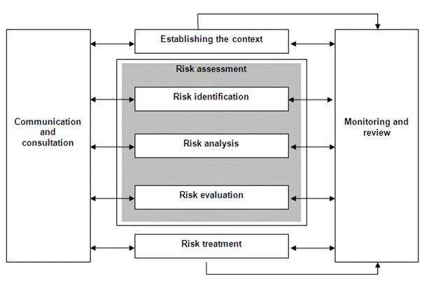

# RM Strategies

* Negative Risks \(or Threats\)
  * Avoid
  * Reduction \(Mitigate\)
  * Share \( Transfer \)
  * Retention \(acceptance\)

* Positive Risks \(or Opportunities\)
  * Exploit
  * Enhance
  * Share
  * Retention

# Risk management strategies ( for threats)

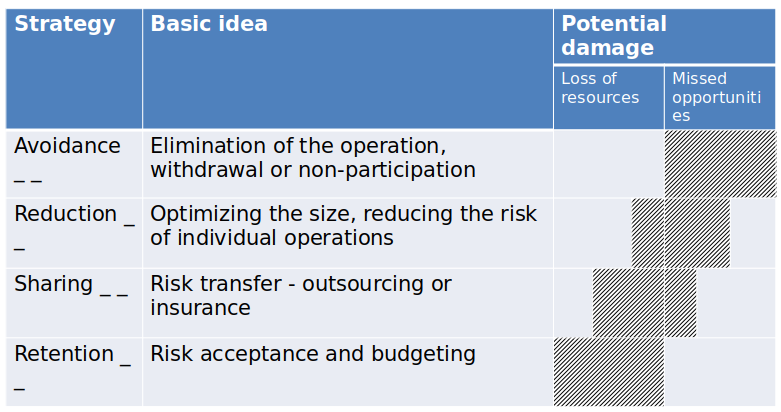

# Risk management strategies (if possible)

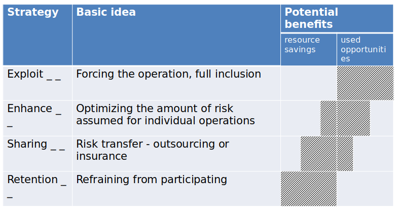

# Two-component risk assessment model

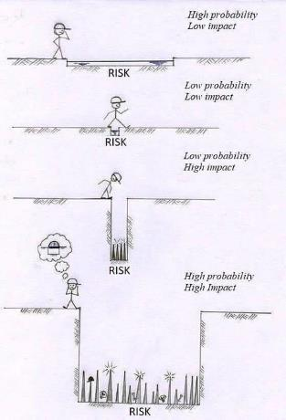

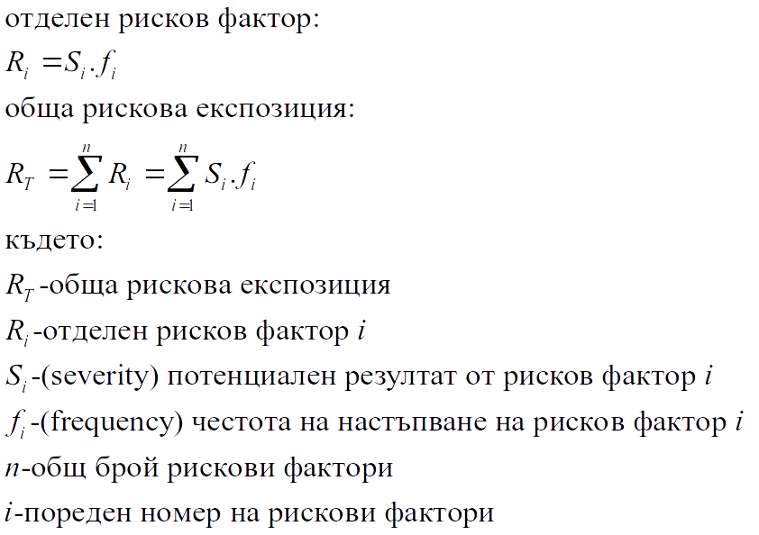

# Risk Prioritization - likelihood and impact

__Likelihood of a risk event occurring__  __ __

__Very High __ : Is almost certain to occur

__High __ : Is likely to occur

__Medium: __ Is as likely not to occur

__Low: __ May occurs occasionally

__Very Low: __ Unlikely to occur

__Risk Impact: The level of damage that can occur when a risk event occurs__

__Very High __ : Huge impact on the success of the project

__High: __ Substantial impact on time\, cost or quality

__Medium: __ Notable impact on time\, cost or quality

__Low: __ Minor impact on time\, cost or quality

__Very Low __ : Negligible impact

# Probability / Impact Ratio…

__www\.derekhendrikz\.com__

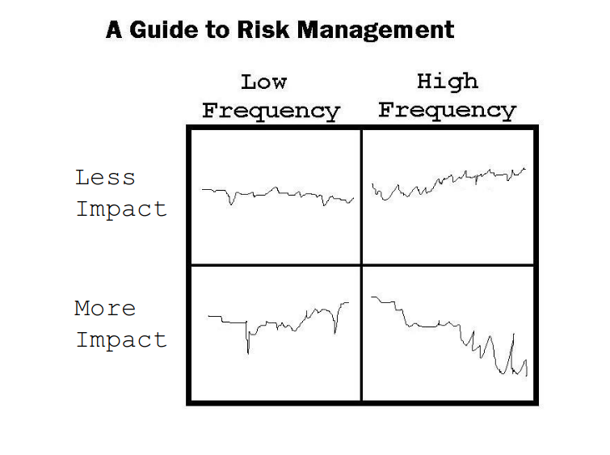

# Application of strategies in risk situations

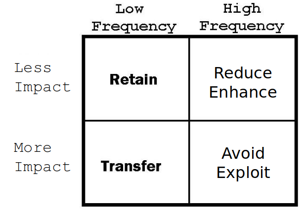

# Strategies in foreign exchange markets

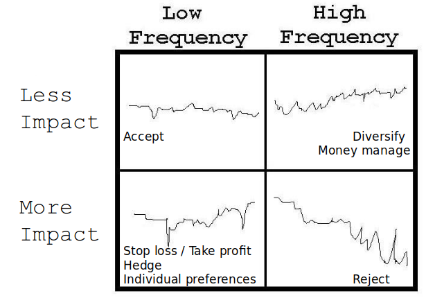

# Risk management tips in investment

Determine Your Risk Tolerance

Know the odds

Update information

Use computer models

Manage the use of leverage \*

Stop\-losses / Take profit \*

Position size & Maximum Risk per Trade \*

Timing \*

Hedging \*

Diversification & Correlation analysis \*\*

# Margin

# 

# Investment leverage

The leverage you use depends on the size of your stop loss\. The smaller your stop loss\, the more leverage you can use while keeping your risk constant\. And the greater your stop loss\, the less leverage you can use while keeping your risk constant\.

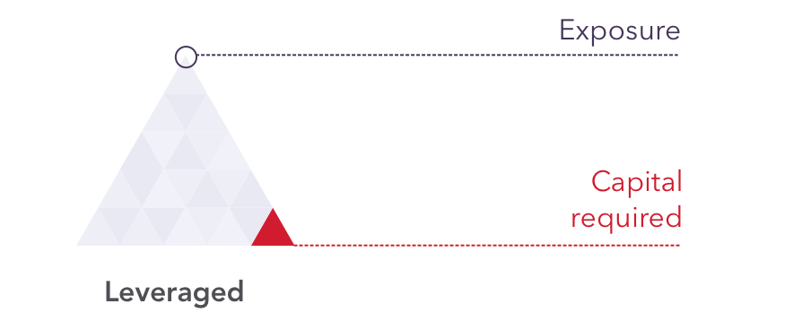

# 

Creative commons \- Angel Marchev\, Jr\.

# Conditional orders

# 

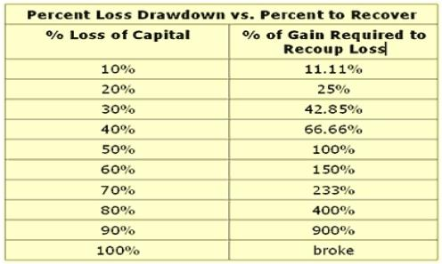

# R R R (Reward to Risk Ratio)

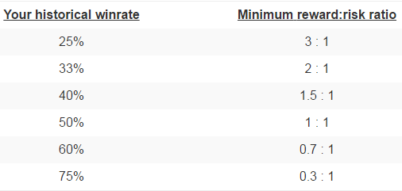

# Minimum Winrate = 1 / (1 + Reward: Risk )

Required Reward: Risk Ratio = (1 / Winrate ) - 1

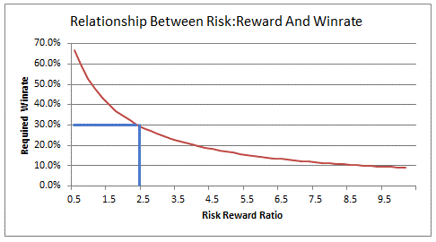

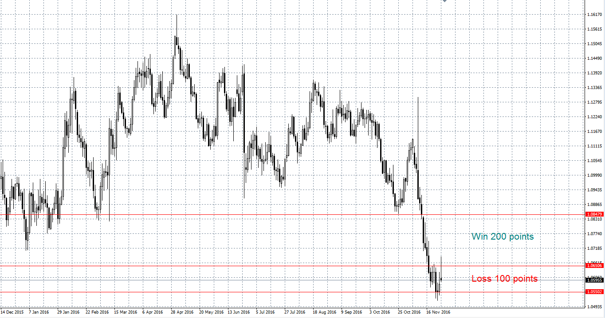

# Recommendations for delimitation on transactions for day / week ( Andrey Stoychev)

* volume of the position is determined in advance set maximum for loss of a single deal and stop level \!
* The assumed risk of a single transaction should not exceed 2%\.
* Restriction on number transactions :
  * 3\-5 / day ;
  * 15\-20 / week
* Restriction after loss
  * 5% / day
  * 10% / week

# Size of positions

# 

# Position size

Account size;

How much risk are you willing to risk on each trade;

Stop loss\.

Creative commons \- Angel Marchev\, Jr\.

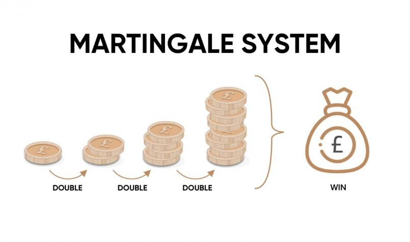

# 

The Martingale system is a methodology to amplify the chance of recovering from losing streaks\.

The Martingale strategy involves doubling up on losing bets and reducing winning bets by half\.

It essentially a strategy that promotes a loss\-averse mentality that tries to improve the odds of breaking even\, but also increases the chances of severe and quick losses\.

Forex trading is more well\-suited to this type of strategy than for stocks trading or casino gambling\.

Creative commons \- Angel Marchev\, Jr\.

# ANTI-MARTINGALE

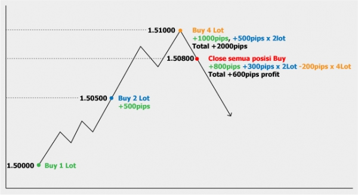

The anti\-Martingale system is a methodology to amplify winning streaks and minimize the impact of losing streaks\.

Opposite of the traditional Martingale system\, the anti\-Martingale strategy involves doubling up on winning bets and reducing losing bets by half\.

It is essentially a strategy that promotes a "hot hand" mentality when on a winning streak and a stop\-loss strategy when there is a losing streak\.

Creative commons \- Angel Marchev\, Jr\.

# 

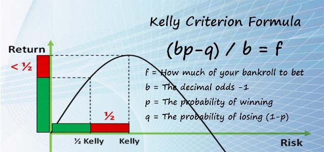

# Kelly Criterion (general case)

K \- invested share of capital

W \- expected winning return

L \- expected losing return

p \- probability of winning

# Simple coin toss bet

_Not symmetrical_

p = 65%; W = 120%

# 

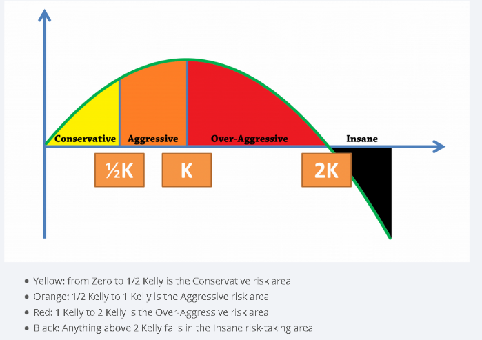

# Applications in for investment

W = TakeProfit

L = StopLoss

p =% of winning trades in similar market conditions \(eg past 100 trades\)

K≤0 => bad investment

K> 1 => additional borrowed capital needed

__ALTERNATIVE:__

# Pros / Cons

__Pros:__

right balance between risk and safety \- by increasing the size of the wager in proportion to the expected value\, you are maximizing your edge

relatively easy to use

__Cons:__

need to work out the real probabilities of stakes \- if your estimates are inaccurate\, then using the formula will lead to incorrect stake size recommendations and an inefficient use

the system is inherently aggressive \- it can lead to the trader using significant fractions of their capital

# Sources with codes

_[https://www\.investorwhiz\.com/concepts//a\-note\-on\-kellys\-formula](https://www.investorwhiz.com/concepts/a-note-on-kellys-formula)_

_[https://www\.bettingexpert\.com/academy/advanced\-betting\-theory/kelly\-criterion\-explained](https://www.bettingexpert.com/academy/advanced-betting-theory/kelly-criterion-explained)_

_[https://www\.gwern\.net/Coin\-flip](https://www.gwern.net/Coin-flip)_

_[http://www\.elem\.com/~btilly/kelly\-criterion/](http://www.elem.com/~btilly/kelly-criterion/)_

_[https://quantstrattrader\.wordpress\.com/2017/09/29/the\-kelly\-criterion\-does\-it\-work/](https://quantstrattrader.wordpress.com/2017/09/29/the-kelly-criterion-does-it-work/)_

_[https://blog\.millionintegrals\.com/kelly\-criterion\-and\-investing/](https://blog.millionintegrals.com/kelly-criterion-and-investing/)_

_[https://blogs\.cfainstitute\.org/investor/2018/06/14/the\-kelly\-criterion\-you\-dont\-know\-the\-half\-of\-it/](https://blogs.cfainstitute.org/investor/2018/06/14/the-kelly-criterion-you-dont-know-the-half-of-it/)_

# Timing

# 

# Arbitration

* taking advantage of price differences in different markets for the same asset\.
* __Necessary Trading Conditions__
* __Asset price imbalance:__
  * different markets\, same asset\, different prices;
  * Assets w / similar cash flows\, different prices;
  * asset w / a known future price\, traded at price different from the expected value of the future cash flows\.
* __Simultaneous trade execution__

Creative commons \- Angel Marchev\, Jr\.

# Triangular Arbitrage

Triangular arbitrage is a form of profit\-making by currency traders in which they take advantage of exchange rate discrepancies through algorithmic trades\.

To ensure profits\, such trades should be performed quickly and should be large in size\.

__Example of Triangular Arbitrage__

With these exchange rates there is an arbitrage opportunity:

Sell dollars for euros: $ 1 million x 0\.8631 = € 863\,100

Sell euros for pounds: € 863\,100 ÷ 1\.4600 = £ 591\,164\.40

Sell pounds for dollars: £ 591\,164\.40 x 1\.6939 = $ 1\,001\,373

Subtract the initial investment from the final amount: $ 1\,001\,373 \- $ 1\,000\,000 = $ 1\,373

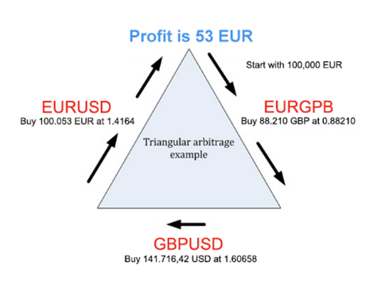

Creative commons \- Angel Marchev\, Jr\.

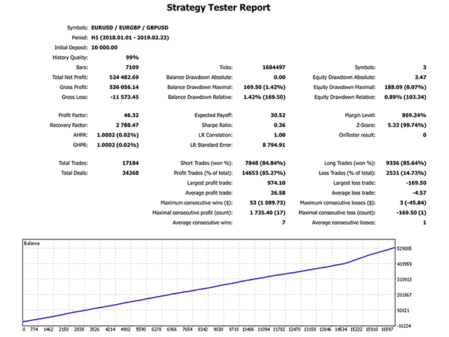

# 

Creative commons \- Angel Marchev\, Jr\.

# Parrondo's Paradox

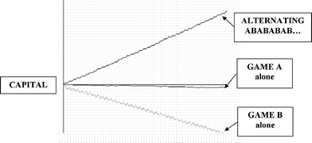

_There are pairs of games\, each with a higher probability of losing than winning\, for which it is possible to construct a winning strategy by playing the games alternately\._

Creative commons \- Angel Marchev\, Jr\.

# Volatility comparison: Crypto - Forex

σ \(EUR\) = 4\.43x10 3

σ \(BTC\) = 6\.48x10 2

# 

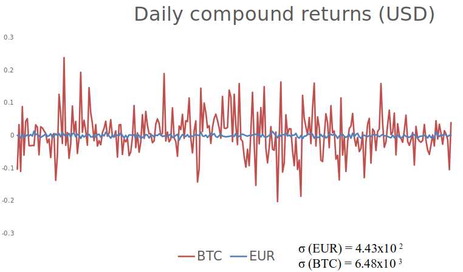

← Risk potential

