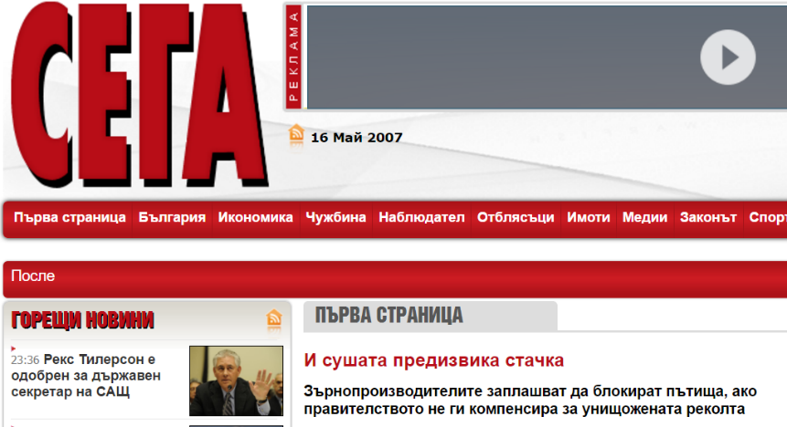
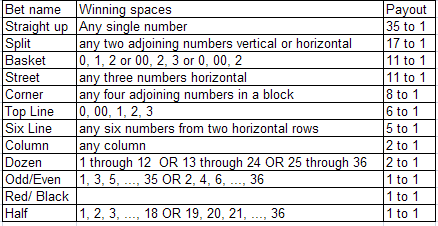

# Some ideas about risk

# Assoc. Prof. Dr. Angel Marchev

Creative commons \- Angel Marchev\, Jr\.

# Introduction

# 

Creative commons \- Angel Marchev\, Jr\.

Creative commons \- Angel Marchev\, Jr\.

Creative commons \- Angel Marchev\, Jr\.

Creative commons \- Angel Marchev\, Jr\.

Creative commons \- Angel Marchev\, Jr\.

Creative commons \- Angel Marchev\, Jr\.

" There must be 100 percent security guarantees \[ to support nuclear energy \]"

January 2013

Creative commons \- Angel Marchev\, Jr\.

# Julian Popov, April 20, 2020

\[ One of the problems \] of Bulgaria is that it does not rule risks while fighting crises \. When there is no crisis\, waiting to come or create it to fight it \. But not with the risk\. Problem that painfully manifested in the context of the pandemic \. The Bulgarian government is very representative of the broad public attitude to risks and crises \(it is therefore a government because represents this well attitude \)\.

The infection is not controlled as a risk\, and as a crisis\. Instead of opening the parks and regulating movement in them \(risk\)\, entry into them \(crisis\) is prohibited \.

Instead of raising standards of education \(risk\)\, we give 5 levs to everyone will return \(crisis\) \.

Instead of developing preventively healthcare \(risk\)\, we are waiting for it to come time for surgery and cut \(crisis\)\.

Instead of controlling traffic on the streets to manage the risk of homicide disasters \, we wait for a tragedy and we react \.

Nobody insures themselves property against fire or flood\. Or robbery\.

Entering and leaving Sofia is not regulated \(risk\)\, but is allowed and then blocked \(crisis\)\.

When there is no crisis\, but there is a sharp feeling that something is wrong \, an emergency crisis conference is convened in the middle night to say that everything is ok \. We urgently want you announce that there is no fire \. We urgently want you announce that the deputies are alive and well \. We shouted you at midnight to tell you that the snowdrops not yet \_ bloomed \, but will bloom \. This is the case with clean air \, helicopter ambulances \, obesity of children \, depopulation of villages \, buying fighter jets and much more \. Thinking about risk is like fear of lessons\, instead of like insurance shelf \.

This one the attitude is deep \. We can trace it back and say that we have not yet shaken off the 1997 economic crisis\. Or in the past \- we have n't ruled for 45 years the country \. Or more further back \, Ottoman a time when no one knew what exactly is happening\, but everyone has developed a skill to get out and sneak \- like Andreshko or as leaving Sofia\. Maybe we are still learning to manage risks \. Maybe we live with the superstitious hope that nothing depends on us\.

Creative commons \- Angel Marchev\, Jr\.

# Stochastic or Determined World?

THESIS: " There is nothing accidental in this world\. The coincidence is due to ignorance of the relevant causal links\. The determinism or randomness of an event is reduced to the  __cognitive abilities of man __ "\(classical physics\, mathematics\)

ANTITHESIS: " According to Heisenberg  __'s uncertainty principle\, __ there are events whose causal relationships cannot be determined within a reasonable time for the event\. This principle means that there are events that cannot be made deterministic\, as a result of which they are unpredictable\. “\(Quantum physics\, engineering\)

Prof\. Georgi Chobanov\, VSIM: 16\, Ravda\, September 2016

Creative commons \- Angel Marchev\, Jr\.

SYNTHESIS \(Marchev\, Jr\.\):

Or there are nondeterministic events in which there are no causal links;

Or man's cognitive ability is insignificantly small compared to the all\-encompassing universe\.

In both cases\, the use of the better \(or only possible\) probabilistic mathematical apparatus is preferred\.

It is especially valid for phenomena of socio\-psychological nature\, which are much closer to quantum mechanics \(observer principle\, randomness \(or incomplete complexity\) of the behavior of objects\, uncertainty of the environment\, incomplete information\, non\- stationary \, etc\.\)\. At the same time\, it is a more pragmatic approach\, where one can always rely on concrete numerical results\. "

Creative commons \- Angel Marchev\, Jr\.

# Fan of possible conversions

Creative commons \- Angel Marchev\, Jr\.

Creative commons \- Angel Marchev\, Jr\.

# Behavior of a real system

Marchev\, Jr\.\, Marchev

# PRESENTATION TITLE

# What is RISK ?

A revolutionary idea marking the border

between the age of modern progress and

The "dark" centuries of the past

Risk explanation philosophy:

Quantitative: " the best solutions are based on numbers"

OR

Psychologically : “ decisions are based

of expectations for the indefinite

future ”

Creative commons \- Angel Marchev\, Jr\.

T he spirit of the definition of risk is captured best by the Chinese symbols for risk \, which are reproduced here\.

The first symbol is for “ danger ”\, while the second is for “ Opportunity ”\, making risk a mix of danger and opportunity \.

It illustrates very clearly the tradeoff that every investor and business has to make \- between the higher rewards that come with the opportunity and the higher risk that has to be borne as a consequence of the danger \.

Aswath Damodaran

\(“ INVESTMENT VALUATION ”\)

Angel Marchev\, Jr\. angel\.marchev@yahoo\.com

# Etymology

Ριζα \(gr\. “ Riza ” \) \- a root later used in Latin for “obstacle ”

_risicum _ \(lat\.\) a specific legal concept of loss and damage

" رزق " \(Arabic: " rizk " \) \- to seek success \( Lat\.  _risk\,_   _riezgo\)_

risicare \(it\.\) \- to laugh\, I dare

Creative commons \- Angel Marchev\, Jr\.

# What is RISK ?

Professor Risk

_[https://www\.youtube\.com/watch?v=a1PtQ67urG4](https://www.youtube.com/watch?v=a1PtQ67urG4)_

Creative commons \- Angel Marchev\, Jr\.

# What is risk - free ?

Creative commons \- Angel Marchev\, Jr\.

# What is a Risk?

A risk is  __ANYTHIN __ G that  __may __ affect the achievement of an organization's objectives\.

It is the  __UNCERTAINTY __ that surrounds future events and outcomes\.

It is the expression of the  __likelihood and impact __ of an event with the potential to influence the achievement of an organization's objectives\.

# Alternatively…

* Risk is a potential event with negative consequences that had not happened yet
  * Could also be an event with positive consequences
* A possibility of loss \- not the loss itself
  * A source of problem
  * Find the root cause and not the leaves
* Something that makes the project special
  * In the widest sense\, everything is a risk
  * Helps identify better ways of handling problems

# Key Terms

* Risk Tolerance \- The amount of acceptable risk
* Risk Adverse \- Someone that does not want to take risks
* Risk Factors
  * _Probability _ of occurrence
  * _Impact _ of event
  * _Range _ of outcomes
  * _Timing _ of event

# Categorizing Risk - Comprehensive

Political or Reputational Risk

Financial Risk

Service Delivery or Operational Risk

People / HR Risk

Information / Knowledge Risk

Strategic / Policy Risk

Stakeholder Satisfaction / Public Perception Risk

Legal / Compliance Risk

Technology Risk

Governance / Organizational Risk

Privacy Risk

Security Risk

Equity Risk

# Diversifiable vs Non Diversifiable

| Diversifiable Risk | Non-diversifiable risk |
| :-: | :-: |
| Risk that can be eliminated through diversification. Also called Unsystematic Risk or controllable risk. | The risk inherent in the entire market or entire market segment. Also known as "systematic risk" or "market risk." |
| It results from the occurrence of random events such as labor strikes, lawsuits, or loss of key accounts. Business, liquidity, and default risks fall into this category. It is assumed that any investor can create a portfolio in which this type of risk is completely eliminated through diversification.  | Interest rates, recession and wars all represent sources of systematic risk because they will affect the entire market and cannot be avoided through diversification. Whereas this type of risk affects a wide range of securities, unsystematic risk affects a very specific group of securities or an individual security. Systematic risk can be mitigated only by being hedged. |

# Basic sources of risk & uncertainty

* Known knowns \(no risk / uncertainty\)
  * Facts\, outcomes or scenarios that we know with absolute certainty\, based on deterministic processes
* Unknown knowns
  * Certain facts that others know but we don't
  * Based on information asymmetry or poor communication
* Known unknowns
  * Potential facts\, outcomes\, scenarios that we are aware of\, but don't yet know with any certainty
  * Based on stochastic processes and known probability laws
* Unknown unknowns
  * Potential facts\, outcomes or scenarios that we are not yet aware of\, have not even considered
  * Often rare and extreme events or outliers \(“black swans”\)\, not considered due to lack of experience / imagination

# Variability

_Uncertainty _ occurs if at least two possible outcomes can arise out of an event\.

If one possible outcome\, then the outcome is known for certain\, so there is no risk\.

* House \- two possibilities \(in relation to fire\):
  * Catch fire or uncertainty exists
  * May not catch fire
* If the house\-owner certain that his house will not catch fire because it was entirely built using fire\-resistant materials\, then there is no risk associated with fire\.

Risk exists if there is uncertainty about the outcome of an event or an activity \.

The greater the number of outcomes from an event\, the greater would be the uncertainty and thus the risk\.

Eg fixed\-return investment vs stock investment

# What is RISK ?

Creative commons \- Angel Marchev\, Jr\.

# Risk measurement

# The classic measure of risk is the variance relative to the mean

Creative commons \- Angel Marchev\, Jr\.

Since the 1980s\, the focus has been more on " Downside " \( Leftside \)\. risk \- only the negative deviations from expectations

Creative commons \- Angel Marchev\, Jr\.

# What is RISK ?

Creative commons \- Angel Marchev\, Jr\.

Creative commons \- Angel Marchev\, Jr\.

# Quantitative aspect of risk

# 

Creative commons \- Angel Marchev\, Jr\.

_[https://phet\.colorado\.edu/sims/plinko\-probability/plinko\-probability\_en\.html](https://phet.colorado.edu/sims/plinko-probability/plinko-probability_en.html)_

Creative commons \- Angel Marchev\, Jr\.

Classic definition: The risk is related to the fact that the  __actual future results will be different from the desired future results\.__  __ __

# Mathematical expectation

Creative commons \- Angel Marchev\, Jr\.

# Quantitative Risk Analysis

* Analyze numerically the probability and consequence of each risk
* Monte Carlo analysis popular
* Decision Tree analysis on test
  * Diagram that describes a decision and probabilities associated with the choices
* Expected Monetary Value Analysis \(EMV\)

# Expected Monetary Value (EMV)

|  | Building Cost | Probability |  |
| :-: | :-: | :-: | :-: |
| Optimistic Outcome | $ 150K | 0.2 | $ 30K |
| Likely Outcome | $ 225K | 0.5 | $ 113K |
| Pessimistic Outcome | $ 300K | 0.3 | $ 100K |
| Expected Value |  |  | $ 243K |

# Decision Tree Analysis

Decision Definition

EMV of New Bldg Node = $ 41\.5\!

New Plant

\- $ 120

Build or Upgrade Plant

Upgrade Plant

\- $ 50

EMV of Upgrade Node = $ 49\!

# Simple, continuous probability distributions can be described by 4 independent parameters

Describes the  __location __ of the distribution

Describes the  __spread __ of the distribution

Describes the  __asymmetry __ of distribution

Describes the  __shape __ of the distribution

# Risk & uncertainty: Basic definitions

* __Expected Value \(EV\) __ is the probability\-weighted average value of a given variable across all potential scenarios
* __Uncertainty __ is the mean absolute deviation \(MAD\) from the  _Expected Value_
  * Includes upside and downside uncertainty
  * Upside = downside: they  _always _ balance\!

# Quantitative aspect of risk

Creative commons \- Angel Marchev\, Jr\.

Creative commons \- Angel Marchev\, Jr\.

Creative commons \- Angel Marchev\, Jr\.

# Problems for medium-probable result (mathematical expectation)

Considering the winnings on the different roulette bets \(listed in the table\)\, calculate the average probable winnings for each bet:

A\) for European roulette \(with a total of 37 flights\)

B\) for American roulette \(with a total of 38 flights\)

\(Answer A for all bets \-0\.02703;

Answer B for all bets \-0\.05263\)

| type of pledge | Payout on profit |
| :-: | :-: |
| exact number | 35 to 1 |
| two numbers | 17 to 1 |
| three numbers | 11 to 1 |
| four numbers | 8 to 1 |
| Six numbers | 5 to 1 |
| Column (12 numbers) | 2 to 1 |
| Third (12 numbers) | 2 to 1 |
| Even or odd (18 numbers) | 1 to 1 |
| Half (18 numbers) | 1 to 1 |
| red or black (18 numbers) | 1 to 1 |

Creative commons \- Angel Marchev\, Jr\.

Your investment can you brought yield of $ 50 with probability 0\.45\, \- $ 5 with probability 0\.15 and \- $ 60 with probability 0\.4\. Is the investment expected to be profitable ?

\( Answer No\, \- $ 2\.25\)

2\. Randomly determined process there is possible values \{1\,3\,2\,3\,4\,2\,1\,3\,5\,2\} s relevant probabilities : 0\.08\, 0\.13\, 0\.06\, 0\.09\, 0\.14\, 0\.11\, 0\.12\, 0\.07\, 0\.11\, 0\.09\. Calculate the medium\-probable value of the process \.

\( Answer 2\.7\)

sold in a store eight goods\. They are priced at $ 3\.50\, $ 5\.00\, $ 3\.50\, $ 7\.50\, $ 5\.00\, $ 5\.00\, $ 3\.50 and $ 7\.50\. The typical customer is Zak the goods with corresponding probabilities: 0\.10\, 0\.15\, 0\.15\, 0\.20\, 0\.10 0\.05\, 0\.10\, 0\.15\. What is the average turnover that the next customer will generate the store?

\( Answer $ 5\.35\)

4\. Depending on the assessments you through fourth semester the average Your success after the end of the second year can be 5\.25 \(with a probability of 24%\)\, 5\.00 \(with a probability of 37%\)\, 4\.75 \(with a probability of 28%\) and 4\.50 \(with a probability of 11%\)\. The minimum Admission score for Business Administration is 4\.94 for girls and 4\.63 for boys \. Is your score expected to reach the rankings ? for specialty Business Administration\, if you are girl ? And if you are boy ?

\( Answer No\, 4\,935; Yes\)

5\. During one \_ thunderstorm in Vitosha National Park there are 127 lightning strikes \. Experience has shown that the probability one flash to start forest fire is 0\.0083\. Determine the expected number forest fires \.

\( Answer 1\.0541\)

6\. Two six\-sided dice are rolled at the same time twenty times in total\. If you earn lev each the time when a numerical sum of less than 7 falls\, determine how much on average you are expected to win \.

\( Answer 8:33 \) \_

7\. Organize a lottery in which one lottery ticket costs $ 10 and the winners tickets receive $ 30 each\. The probability of winning is 0\.2\. Sold are fifty tickets\. What is the average \- expected you profit ?

\( Answer $ 200\)

Creative commons \- Angel Marchev\, Jr\.

# Subjective (psychological) aspects

# 

Creative commons \- Angel Marchev\, Jr\.

# St. Petersburg Paradox

You play a game of chance in which a one\-time entry fee is paid\. Then a fair coin is tossed again until the "round" falls\, ending the game\.

The table starts from BGN 1 and doubles for each "language"\. You win whatever is on the floor at the end of the game\.

For example: you win BGN 1 if the "round" falls on the first roll\, BGN 2 on the second\, BGN 4 on the third\, etc\. In short\, you will win BGN 2k − 1 if the coin is tossed k times before the "round" falls for the first time\. With a probability of 1/2 you win BGN 1; with probability 1/4 you win BGN 2\, with probability 1/8 you win BGN 4\, etc\.

What do you think would be a fair entry fee for you?

Creative commons \- Angel Marchev\, Jr\.

To answer this\, one needs to consider what would be the average payout: with probability 1/2\, the player wins 2 dollars; with probability 1/4 the player wins 4 dollars; with probability 1/8 the player wins 8 dollars\, and so on\. The expected value is thus

Nicolaus II Bernoulli

Daniel Bernoulli

“The determination of the value of an item must not be based on the price\, but rather on the utility it yields…\. There is no doubt that a gain of one thousand ducats is more significant to the pauper than to a rich man though both gain the same amount\. ”

# Risk Utilities

* __Risk utility __ or  __risk tolerance __ is the amount of satisfaction or pleasure received from a potential payoff:
  * Utility rises at a decreasing rate for a person who is  __risk\-averse\.__
  * Those who are  __risk\-seeking __ have a higher tolerance for risk and their satisfaction increases when more payoff is at stake\.
  * The  __risk neutral approach __ achieves a balance between risk and payoff\.

# Risk Utility Function & Risk Preference

Homo economicus \- the concept of the rational economic agent \(loves income\, does not love risk\)

# Utility function

Creative commons \- Angel Marchev\, Jr\.

# Predisposition

_[https://www\.youtube\.com/watch?v=7TL\-KHYXjiU](https://www.youtube.com/watch?v=7TL-KHYXjiU)_

Creative commons \- Angel Marchev\, Jr\.

# Example of a propensity to take a risk test

__Which investment would you choose?__

\(Anual expected return adjusted for inflation and transaction costs\.\)

Creative commons \- Angel Marchev\, Jr\.

# Example of a result on the risk appetite scale

Creative commons \- Angel Marchev\, Jr\.

# Experiment

Imagine the following situation: You have 100 euros and you are given a choice \- receive another 50 euros or toss a coin for a 50% chance to win 100 euros and 50% to win nothing\. What would you choose?

Significant majority of people choose the non\-risky alternative and get the sure 50 euro\, and by doing so they confirm the risk\-averse hypothesis

Now imagine a similar situation: You have 150 euros and you are given a choice \- lose 50 euros or toss a coin for a 50% chance to lose 100 euros and 50% to lose nothing\. What would you choose?

Significant majority of people choose the risky alternative and take risk for the chance of not losing anything\. So all of a sudden they become loss\-averse

# Risk-Taking in animal models

Bumblebees were foraging in an artificial field with:

Certain flowers: 3 μ l of nectar for sure\.

Risky flowers: 6 μ l \(50%\) or nothing \(50%\)\.

Bumblebees preferred certain flowers\.

Monkeys were required to choose between two options:

Certain circle: 30 ml of juice for sure\.

Risk circle: 50 ml \(50%\) or 10 ml \(50%\)\.

Monkeys preferred risky options\.

\(Real\, 1995; McCoy & Platt\, 2005\)

Decisions in Social Context

The nature of decision\-making fundamentally changes within social contexts\.

A paradigm that adequately represents rationality violation is the loss averse behavior\.

A perfectly rational responder should accept any offer randomly \(as the payoff is the same\)\.

In reality\, players systematically do not conform to these predictions \.

# Prospect theory

* The individual propensity to risk is
* Fundamental concept in economic
* Science\, especially in investment choice
* " rational man who avoids risk\."
* the leading paradigm \.
* It is a somewhat contradictory paradigm
* "Prospect theory"\, developed by Kahneman and Tversky
  * A large number of experiments with individual choice
  * OR the essence of man is irrational
  * OR the concept of a rational solution needs to be developed and supplemented
* The difficulty with changing the paradigm in the social sciences is that a sufficiently comprehensive and definitive experiment cannot be applied\.

Creative commons \- Angel Marchev\, Jr\.

__Subjective Value__

__Subjective Value__

__Objective outcome__

__Objective outcome__

\(Kahneman & Tversky\, 1979\)

# Questions

http://bit\.ly/risk\-pref

You have choice between two instant deals

one with 100% guaranteed profit

second without guaranteed profit \.

In the first case you get X euros\, and in the second there is exactly 50% probability of winning \, equal to twice X euros and exactly 50% probability of 0 euros\.

Which deal would you choose \( be sure to choose one of the two answers for each choice \)?

| A) X = 1 | 1) 1 EU 2) 0 EU or 2 EU | D) X = -1  | 1) -1 EU 2) 0 EU or -2 EU |
| :-: | :-: | :-: | :-: |
| B) X = 10 | 1) 10 EU 2) 0 EU or 20 EU | H) X = -10 | 1) -10 EU 2) 0 EU or -20 EU |
| C) X = 100  | 1) 100 EU 2) 0 EU or 200 EU | I) X = -100 | 1) -100 EU 2) 0 EU or -200 EU |
| D) X = 1000  | 1) 1000 EU 2) 0 EU or 2000 EU | J) X = -1000 | 1) -1000 EU 2) 0 EU -2000 EU |
| E) X = 10000  | 1) 10000 EU 2) 0 EU or 20000 EU | K) X = -10000  | 1) -10000 EU 2) 0 EU or -20000 EU |
| F) X = 100000  | 1) 100000 EU 2) 0 EU or 200000 EU | L) X = -100000 | 1) -100000 EU 2) 0 EU or -200000 EU |

Creative commons \- Angel Marchev\, Jr\.

# Risk propensity test

You have choice between two instant deals

one with 100% guaranteed profit

second with risky \, not guaranteed profit with exactly 50% probability of profit equal to Y euro and exactly 50% probability for 0 euro\.

Indicate the amount at which you would refuse to risk between Y and 0 euros \( be sure to write one amount for each row \, size between 0 and Y\):

\( do the whole test at  _[http://bit\.ly/risk\-pref ](http://bit.ly/risk-pref)_ \)

| A) Y = 2 | 1) X = _______ 2) 0 EU or 2 EU | D) Y = - 2   | 1) X = _______ 2) 0 EU or -2 EU |
| :-: | :-: | :-: | :-: |
| B) Y = 2 0 | 1) X = _______  2) 0 EU or 20 EU | H) Y = - 2 0 | 1) X = _______ 2) 0 EU or -20 EU |
| C) Y = 2 00  | 1) X = _______ 2) 0 EU or 200 EU | I) Y = - 2 00 | 1) X = _______ 2) 0 EU or -200 EU |
| D ) Y = 2,000  | 1) X = _______ 2) 0 EU or 2000 EU | J) Y = -  | 1) X = _______ 2) 0 EU -2000 EU |
| E) Y = 2 0000  | 1) X = _______ 2) 0 EU or 20000 EU | K) Y = - 2 0000  | 1) X = _______ 2) 0 EU or -20000 EU |
| F) Y = 2 00000  | 1) X = _______ 2) 0 EU or 200000 EU | L) Y = - 2 00000 | 1) X = _______ 2) 0 EU or -200000 EU |

Creative commons \- Angel Marchev\, Jr\.

# Share of professional investors taking risks in different cases

Creative commons \- Angel Marchev\, Jr\.

# Comparison with non-professional investors

Creative commons \- Angel Marchev\, Jr\.

# Frequency distribution of respondents according to risk appetite

Creative commons \- Angel Marchev\, Jr\.

# Video

Lauri Santos

_[https://www\.youtube\.com/watch?v=DUd8XA\-5HEk](https://www.youtube.com/watch?v=DUd8XA-5HEk)_

Creative commons \- Angel Marchev\, Jr\.

Members of parliament

_[https://www\.youtube\.com/watch?v=\_nLEYA1ETq0](https://www.youtube.com/watch?v=_nLEYA1ETq0)_

Creative commons \- Angel Marchev\, Jr\.

Superstition

_[https://www\.youtube\.com/watch?v=UAgkq2NKpso&t=2s](https://www.youtube.com/watch?v=UAgkq2NKpso&t=2s)_

Creative commons \- Angel Marchev\, Jr\.

