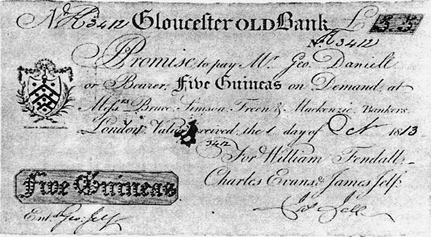

# SHARES AND AND BONDS

# FINANCIAL MARKETS

The most significant part of the finances\, judging by the number of participants and / or the volume of financial and monetary exchange

Well\-functioning financial markets are at the heart of thriving economies

In fact\, they are the most important criterion for the existence of a functioning market economy

__DISCIPLINES STUDYING FINANCIAL MARKETS__

Financial markets and instruments

Financial modeling

Exchanges and exchange operations

Financial engineering

* __CLASSIFICATION OF FINANCIAL MARKETS__
* Banking / insurance services market
* Capital market \(stock market\)
  * Stock market \(regulated\)
  * OTC market
* Money market \(foreign exchange market\)
  * Interbank market
  * Private individuals market

Main participants in the financial markets

Issuance of securities

Equity securities \(shares\)\.

Debt securities \(bonds\)\.

Derivatives

Government securities

Financial intermediation

Stock exchange operations

Methods for financial investment analysis

Market panics

Financial fraud

Quasi exchanges

# STOCK MARKETS

* History of stock markets
* Prerequisites for the appearance:
  * Hunger for capital
  * Search for investment opportunities
  * Search for opportunities to trade risk and income
* The importance of stock markets for the current economic situation in the world

# FINANCIAL INSTRUMENTS

* Main types:
  * Debt \(bonds\)
  * Co\-ownership \(shares\)
  * Hybrid / derivative
* Profile of financial instruments
  * Risk
  * Income
  * Deadlines

# SHARE CAPITAL

* Co\-ownership method for raising capital
* Shareholder rights:
  * Co\-ownership
  * Dividend
  * Share of the property in liquidation
  * Activity control
  * Voice of the General Assembly
* Mandatory details of the action:
  * Denomination
  * Name of the holder or "Bearer"

# DEBT CAPITAL

* Borrowing method for raising capital
* Rights of the bondholder:
  * Interest
  * Advantage in liquidation
* Mandatory details of the bond:
  * Denomination
  * Interest
  * Name of the holder or "Bearer"

# Government securities (government securities) - essence

OBLIGATION

__I promise to pay to the bearer \!\!\!__

…………………………………………………………

……………………………………………………… \.\.\.

London\, William III

1694 King of England

# ISSUE OF SECURITIES

* Ways of organizing
  * Public broadcast
    * General offer
    * Privileged subscription
  * Direct supply
* Underwriter
* Secondary market

# FINANCIAL INSTRUMENTS

* Main types:
  * Debt \(bonds\)
  * Co\-ownership \(shares\)
  * Hybrid / derivative
* Main types of derivatives:
* Option
* Futures
* Forward contract
* Swap

