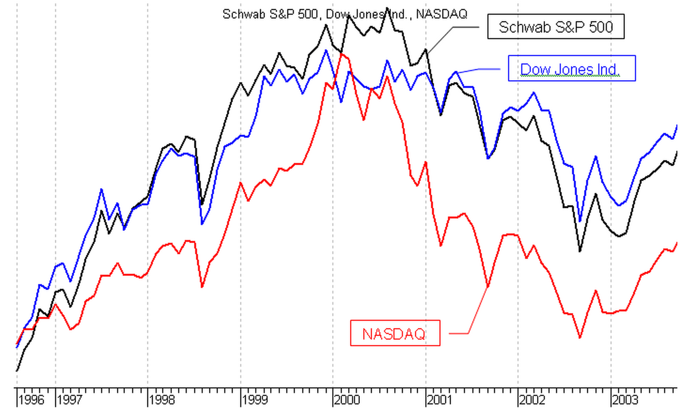

# TECHNICAL ANALYSIS OF INVESTMENT INSTRUMENTS

# 

# Applicability

It is often identified with the so\-called "Chartism"\, as it is mainly based on the graphical representation of time series\.

The methods of technical analysis are applicable when working with data on securities\, indices\, commodities or any other tradable instrument in which  __the price is influenced by the laws of supply and demand\.__

# Postulates of Charles Dow

The price values everything

The movement of prices is not entirely accidental

"What" is more important than "Why"

# "The price evaluates everything"

The price of a financial instrument reflects all the essential information about it

Therefore\, price is the fair value of the asset and can be used as a basis for analysis

The market price reflects the aggregate knowledge of all market participants \(investors and intermediaries; seller\-side analysts and buyer\-side analysts; market strategists and portfolio managers; technical analysts and fundamental analysts\)

Technical analysis uses information "embedded" in the price to interpret what the market says

# "The movement of prices is not entirely accidental "

Although there are periods when prices move relatively randomly\, they generally follow trends

It is therefore possible to identify a trend\, trade and / or invest according to it and profit from the right forecast

The methods of technical analysis can be applied to different time horizons and respectively to detect both short\-term and long\-term trends

# "What" is more important than "Why"

Focusing on price\, technical analysis is a fairly direct approach

Analysts ask only two questions: "What is the current price?" and "What has been the price movement so far?"

Questions beginning with "Why" are considered too ambiguous\, and their answers are quite dubious\.

Price is the result of the laws of supply and demand

The price of an asset is just what someone is willing to pay for it

The answer to the question "Why did the price go up?" is \- "Because there are more buyers than sellers

# Method of technical analysis

* The scope of technical analysis involves working with data on phenomena of different scales and may include:
  * Extensive market analysis through major market indices \- eg S&P 500\, Dow Jones Industrial\, NASDAQ\.
  * Sector analysis in order to identify the strong and weak groups of securities on the market\.
  * Individual analysis in order to identify the strengths and weaknesses of securities within a selected group\.
* The biggest advantage is the versatility:
  * It does not depend on the length of the study period
  * It does not depend on the type of research tool
  * The principles are valid in all cases and therefore the analysis of each of the segments \(market\, sector\, individual instrument\) would use the same tools\.

* Flexibility \- the analysis can be as complex as needed
* _Example _ methodology:
  * Comparison with major economic indices;
  * Study of trends and deviations;
  * Search for levels of support and resistance;
  * Research with oscillatory methods and price indicators

# Comparison with major market indices

# Research trends and look for deviations

# Seek levels of support and resistance

# Combining trends and levels of support and resistance

# Survey with price methods ( overlays)

# Research with oscillatory indicators

# Method of technical analysis

Other ways of presenting prices

